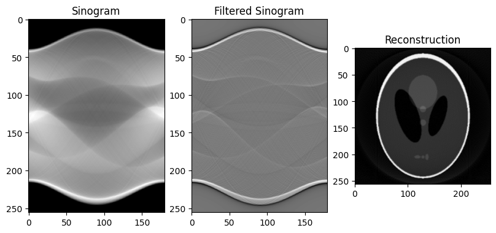

# Analytical Tomographic Image Reconstruction

Welcome to the Analytical Tomographic Image Reconstruction repository! This collection of Python code provides implementations for various analytical tomographic image reconstruction algorithms. These algorithms play a crucial role in transforming projection data into detailed images, making them valuable tools in medical imaging, materials science, and more.

## Code Structure

1. **backprojection.py**
   - Implementation of the Backprojection algorithm.

2. **data_generator.py**
   - Generates 2D data for testing purposes.
   - Options include loading an image, using the Shepp-Logan phantom, or generating a simple Disk object.

3. **filters.py**
   - Implementation of various filters used in tomographic image reconstruction.
   - Includes filters for Backproject Filter and Filter Backprojection algorithms.

4. **fourier_gridding.py**
   - Performs radial-to-cartesian interpolation on a 2D Fourier Transform.

5. **fourier_transform.py**
   - Implementation of the Fourier Transform.

6. **radon_transform.py**
   - Implementation of the Radon Transform.

7. **tutorials.ipynb**
   - Jupyter notebook demonstrating the usage of all reconstruction methods with examples and visualizations.

## Usage

To get started, explore the provided `tutorials.ipynb` notebook for comprehensive examples and visualizations of each reconstruction method. You can experiment with different data sources and filters to see how these algorithms perform under various conditions.

## Contributing

We welcome contributions to enhance and expand this repository. If you have improvements, additional algorithms, or new features to suggest, please feel free to open an issue or submit a pull request.

## Acknowledgments

Special thanks to me for writing this and Prof. Lasser for the wonderful Seminar course

## License

This code is released under the [MIT License](LICENSE.md). Feel free to use, modify, and distribute the code in accordance with the terms of the license.

Happy reconstructing! 🌐🖼️
